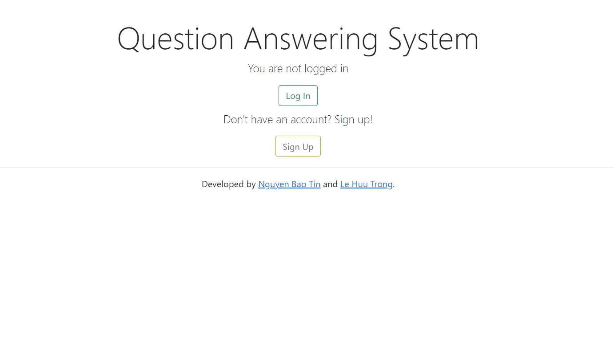
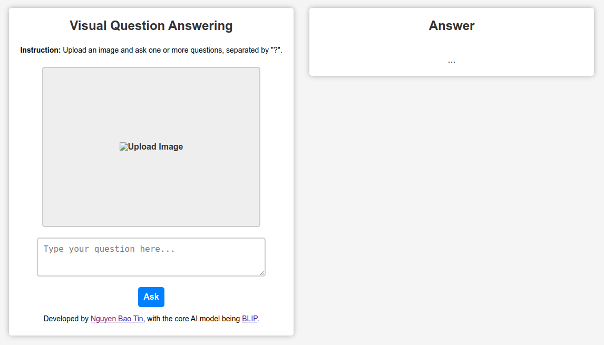
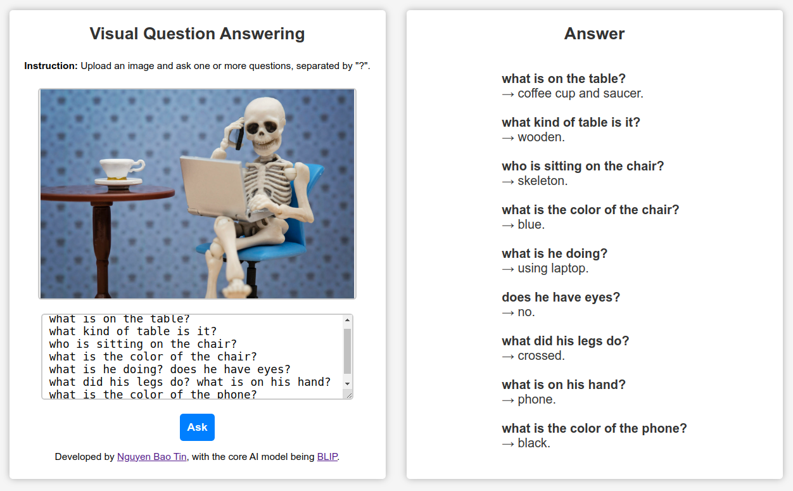
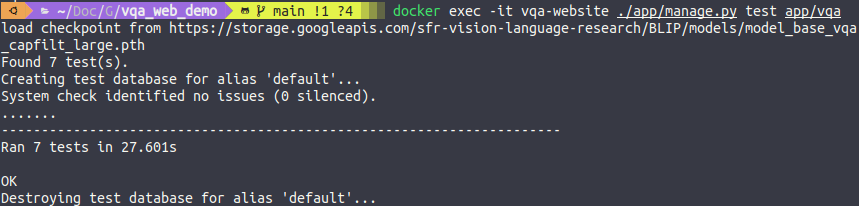

<p align="center">
  <h1 align="center"> Visual Question Answering Demo</h1>
  <p align="center" style="font-weight: bold">Ask anything about the images!</p>
</p>



This repository contains a [**Visual Question Answering**](https://huggingface.co/tasks/visual-question-answering) (VQA) demo web app that utilizes the [**BLIP**](https://arxiv.org/abs/2201.12086) (Bootstrapping Language-Image Pre-training) model for unified vision-language understanding and generation. 

**Information:**
- **Frontend:** HTML, CSS, Javascript.
- **Backend:** Django.
- **Database:** Not used in this quick VQA demo.
- **Deployment:** Docker.
- **Developer:** [Nguyen Bao Tin](https://github.com/nbtin).


## Table of Contents
- [1. Introduction](#1-introduction)
- [2. Technical Overview](#2-technical-overview)
- [3. How to Install](#3-how-to-install)
- [4. Usage](#4-usage)
- [5. How to run automated tests](#5-how-to-run-automated-tests)
- [6. References](#6-references)

## 1. Introduction
[**Visual Question Answering**](https://huggingface.co/tasks/visual-question-answering) (VQA) is a challenging task in the field of computer vision and natural language processing. It involves answering questions about an image based on its visual content. There are several potential applications for VQA, including helping visually impaired individuals understand their surroundings, assisting with image retrieval in large databases, and improving the capabilities of autonomous robots and vehicles.

This repository provides a web application that demonstrates the capabilities of the [**BLIP**](https://arxiv.org/abs/2201.12086) model for VQA. The app allows users to upload images and ask questions, and the model provides answers based on the visual information present in the images.


## 2. Technical Overview
The core AI model used in this demo web app is the **BLIP** model. The **BLIP** model is a state-of-the-art vision-language model and it achieves impressive results on various vision-language tasks, including VQA. This web app used the model which was implemented using [Pytorch](https://pytorch.org/) at the [original repo of BLIP](https://github.com/salesforce/BLIP).

The web app is built using the [Django framework](https://www.djangoproject.com/). Django provides a convenient and efficient way to handle web requests and build interactive web applications. By utilizing Django, we can easily integrate the BLIP model into the web app and provide a seamless user experience.

For the full list of dependencies, see [requirement.txt](requirements.txt).

To ensure consistent and reproducible installations, this repository is packaged using [Docker](https://www.docker.com/). Docker allows us to encapsulate the entire application and its dependencies into a container, making it easy to deploy the app on any machine with Docker installed. The Docker image includes all the necessary libraries and dependencies required to run the web app and execute the BLIP model.

## 3. How to Install
To install and run the VQA demo web app, please follow the steps below:

1. Ensure that Docker is installed on your system. You can download and install Docker from the official website: [Docker Engine for Ubuntu](https://docs.docker.com/engine/install/ubuntu/) or [Docker Desktop](https://www.docker.com/products/docker-desktop/).

2. Clone this repository to your local machine using the following command:

   ```shell
   git clone https://github.com/nbtin/vqa_web_demo
   ```

3. Navigate to the project directory:

   ```shell
   cd vqa_web_demo
   ```

4. Build the Docker image and run the container using the following command:

   ```shell
   docker compose up --build
   ```

   **Note:** The first time you run the above command, you will need to be patient :smile:. This process may take up to 30 minutes depending on your internet speed. This is because the process involves downloading libraries (also includes some libraries to run on GPU if available) and the **BLIP** model, which has a size of approximately *1.35 GB*.

5. Wait for the installation process to complete. Once the downloading is done, the web app will be ready to use.

## 4. Usage
To use the web app, follow the steps below:

1. Open your web browser and navigate to [http://localhost:8080](http://localhost:8080).

2. In the web app, you can browse and upload an image using the provided interface.
    

3. You can ask one or more questions about the image by typing them into the input field, separated by a question mark ("?"). For example, you can ask *"How many people are there?"* or *"What are they doing? What color of their shirt?"* ...

   - You can break the line in question box by holding `Shift` and pressing `Enter`.

4. To submit your questions and obtain answers, press the `Enter` key or click on the `Ask` button.

5. The model will then process your request and provide answers based on the visual content of the image. The execution time depends on the number of questions asked. The more questions you ask, the more time it takes to execute.
    

## 5. How to run automated tests

To run automated tests for this application, you simply open a new terminal and run the following command:

```shell
docker exec -it vqa-web-app ./app/manage.py test app/vqa
```

After running this command, you will see the test results as shown below:


## 6. References

- **BLIP: Bootstrapping Language-Image Pre-training for Unified Vision-Language Understanding and Generation.** - Junnan Li, Dongxu Li, Caiming Xiong, Steven Hoi - [arXiv:2201.12086](https://arxiv.org/abs/2201.12086) (2022).
- **BLIP: Bootstrapping Language-Image Pre-training for Unified Vision-Language Understanding and Generation.** - Junnan Li, Dongxu Li, Caiming Xiong, Steven Hoi - [Repo](https://github.com/salesforce/BLIP).
- **Guides on using Docker for Python application** - [Docker docs](https://docs.docker.com/language/python/).
- **Django REST API UNIT Testing** - Tafadzwa Lameck Nyamukapa - [Video](https://youtu.be/z6_v1UQ9Ht0).
- **Install Docker Engine on Ubuntu** - [Docker docs](https://docs.docker.com/engine/install/ubuntu/).

## Final Notes

**Thanks for going through this Repository! Have a nice day.**

Got any queries? Feel free to contact me via <a href = "mailto: baotin2402@gmail.com">E-mail</a>.