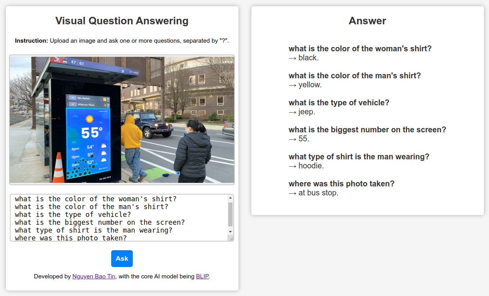
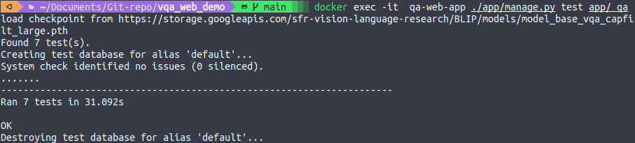

<p align="center">
  <h1 align="center"> Question Answering System</h1>
  <p align="center" style="font-weight: bold">Ask me anything about text or images!</p>
</p>



This repository contains a **Question Answering** web app for both [**Text-based**](https://huggingface.co/tasks/question-answering) and [**Visual Question Answering**](https://huggingface.co/tasks/visual-question-answering) (VQA).

- For the VQA tasks, we use the [**BLIP**](https://arxiv.org/abs/2201.12086) (Bootstrapping Language-Image Pre-training) model for unified vision-language understanding and generation.
- For the text-based tasks, we use the [**DistilBERT**](https://huggingface.co/distilbert-base-uncased-distilled-squad) model for question answering.

**Information:**

- **Frontend:** [Django templates](https://docs.djangoproject.com/en/4.2/topics/templates/) (HTML, CSS, Javascript).
- **Backend:** [Django](https://www.djangoproject.com/).
- **Database:** Not used in this web app.
- **Deployment:** [Docker](https://www.docker.com/).
- **Developers:** [Nguyen Bao Tin](https://github.com/nbtin) & [Le Huu Trong](https://github.com/lhtrong).

## Table of Contents

- [1. Introduction](#1-introduction)
- [2. Technical Overview](#2-technical-overview)
- [3. How to Install](#3-how-to-install)
- [4. Usage](#4-usage)
- [5. How to run automated tests](#5-how-to-run-automated-tests)
- [6. References](#6-references)

## 1. Introduction

[**Visual Question Answering**](https://huggingface.co/tasks/visual-question-answering) (VQA) is a challenging task that combines computer vision and natural language processing to answer questions about images.

Besides, [**Text-based Question Answering**](https://huggingface.co/tasks/question-answering) is a task that aims to answer questions based on a given context. The context can be a paragraph, a document, or a set of documents. The answer to the question is a span of text in the context.

This repository provides a web application that allows users to upload images or enter some paragraphs and ask questions, then the models provide answers based on the visual content of the image or the context of the paragraph.

## 2. Technical Overview

The core AI models used in this web app are **BLIP** and **DistilBERT**.

- The **BLIP** model is a state-of-the-art vision-language model and it achieves impressive results on various vision-language tasks, including VQA. This web app used the model that was implemented using [Pytorch](https://pytorch.org/) at the [original repo of BLIP](https://github.com/salesforce/BLIP).
- The **DistilBERT** model is a smaller version of [BERT](https://huggingface.co/transformers/model_doc/bert.html) (Bidirectional Encoder Representations from Transformers) and it is trained to be smaller and faster while retaining most of BERT's accuracy. This web app used the model via Hugging Face API at [DistilBERT](https://huggingface.co/distilbert-base-uncased-distilled-squad).

The web app is built using the [Django framework](https://www.djangoproject.com/). Django provides a convenient and efficient way to handle web requests and build interactive web applications. By utilizing Django, we can easily integrate these models into the web app and provide a seamless user experience.

For the full list of dependencies, see [requirement.txt](requirements.txt).

To ensure consistent and reproducible installations, this repository is packaged using [Docker](https://www.docker.com/). Docker allows us to encapsulate the entire application and its dependencies into a container, making it easy to deploy the app on any machine with Docker installed. The Docker image includes all the necessary libraries and dependencies required to run the web app and execute the BLIP model.

## 3. How to Install

To install and run the VQA demo web app, please follow the steps below:

1. Ensure that Docker is installed on your system. You can download and install Docker from the official website: [Docker Engine for Ubuntu](https://docs.docker.com/engine/install/ubuntu/) or [Docker Desktop](https://www.docker.com/products/docker-desktop/).

2. Clone this repository to your local machine using the following command:

   ```shell
   git clone https://github.com/nbtin/qa_web_demo
   ```

3. Navigate to the project directory:

   ```shell
   cd qa_web_demo
   ```

4. Build the Docker image and run the container using the following command:

   ```shell
   docker compose up --build
   ```

   **Note:** The first time you run the above command, you will need to be patient :smile:. This process may take up to 30 minutes depending on your internet speed. This is because the process involves downloading libraries (also includes some libraries to run on GPU if available) and the **BLIP** model, which has a size of approximately _1.35 GB_.

5. Wait for the installation process to complete. Once the downloading is done, the web app will be ready to use.

## 4. Usage

To use the web app, follow the steps below:

1. Open your web browser and navigate to [http://localhost:8080](http://localhost:8080).

2. Register an account or login with your existing account.
   

3. After logging in, you will be redirected to the home page. In the home page, you can choose to use some user-center functions such as: view profile (and update profile), change password, logout, ... (see the image below for more details).

   

   `Credit`: I used the user management system from [this repo](https://github.com/hellomlorg/django-login-logout)

4. If you want to you the main functions of this web app, please click on `Use Question Answering System` button. You will be redirected to the main page of the web app.
   

5. After upload an image or enter some text, you can ask one or more questions about the context by typing them into the input field, separated by a question mark ("?"). For example, you can ask _"How many people are there?"_ or _"What are they doing? What color of their shirt?"_ ...

   - You can break the line in question box by holding `Shift` and pressing `Enter`.

6. To submit your questions and obtain answers, press the `Enter` key or click on the `Ask AI` button.

7. The model will then process your request and provide answers based on the context you provided. The execution time depends on the number of questions asked. The more questions you ask, the longer it takes to execute.

   Here is an example of the VQA task, you can do the same with the text-based task:
   

## 5. How to run automated tests

To run automated tests for this application, you simply open a new terminal and run the following command:

```shell
docker exec -it qa-web-app ./app/manage.py test app/qa
```

After running this command, you will see the test results displayed below:


## 6. References

- **BLIP: Bootstrapping Language-Image Pre-training for Unified Vision-Language Understanding and Generation.** - Junnan Li, Dongxu Li, Caiming Xiong, Steven Hoi - [arXiv:2201.12086](https://arxiv.org/abs/2201.12086) (2022).
- **BLIP: Bootstrapping Language-Image Pre-training for Unified Vision-Language Understanding and Generation.** - Junnan Li, Dongxu Li, Caiming Xiong, Steven Hoi - [Repo](https://github.com/salesforce/BLIP).
- **Guides on using Docker for Python application** - [Docker docs](https://docs.docker.com/language/python/).
- **Django REST API UNIT Testing** - Tafadzwa Lameck Nyamukapa - [Video](https://youtu.be/z6_v1UQ9Ht0).
- **hello ML** - User management system - [Repo](https://github.com/hellomlorg/django-login-logout).
- **Hugging Face API** - [DistilBERT](https://huggingface.co/distilbert-base-uncased-distilled-squad).

- **Install Docker Engine on Ubuntu** - [Docker docs](https://docs.docker.com/engine/install/ubuntu/).

## Final Notes

**Thanks for going through this Repository! Have a nice day.**

Do you have any questions? Feel free to contact me via <a href = "mailto: baotin2402@gmail.com">E-mail</a>.
